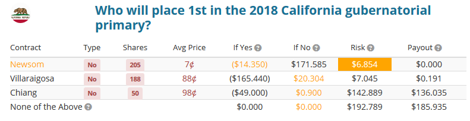
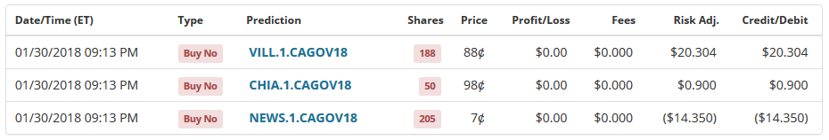
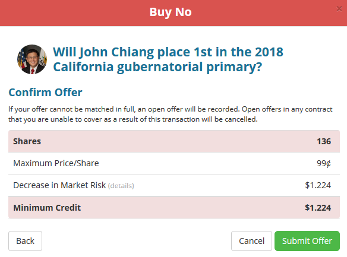

# Negative Risk on PredictIt

## PredictIt 'Risk'

When you buy and sell shares in a multiple-contract market on PredictIt, PredictIt computes the maximum possible amount of money you can lose in any outcome, and only deducts that amount from your available balance, rather than the actual cost of the shares. This 'maximum possible loss' is known as your **risk** for the market.

The advantage of this system is that if your risk is lower than the cost of the shares you purchased, you can go and spend that money elsewhere, allowing you to get a potentially higher return on a smaller investment. If you're smart about your trades, you can minimize your risk without reducing your potential profit, and have extra money available to invest in other markets. You may even be able to get your risk to be negative, leaving you *immediately* with more money than you started with in your available balance.

## Tips To Minimize Your Risk

1. Buy 'no' shares instead of 'yes' shares. Owning 'no' shares in multiple contracts will always give you a lower risk than the total purchase value of those shares. PredictIt includes a potential 'all of these contracts resolve no' option in risk calculations so you can never have negative risk with 'yes' shares. Additionally 'yes' share prices in PredictIt markets.
2. PredictIt will display how much your risk changes in the "Preview" menu before you submit a trade order under "Minimum Credit"/"Maximum Debit". You can play around with the number of shares to try to optimize how much credit you get.
3. Markets with a larger number of contracts are easier to minimize risk in. Big elections or bracketed markets (like poll markets or tweet markets) are great for this.
4. In higher-volume markets, place orders below the current 'buy no' prices (but above 'sell no'). People buying up 'yes' shares will be happy to get a lower price, and you get a lower risk.
5. Keep in mind the limits of shares you can buy. There are only a finite amount of shares available, and you are limited to owning a maximum of $850 of shares in each contract (regardless of risk)
6. Keep in mind the 10% fee on profit (but not loss) that PredictIt takes. This is included in risk calculations by PredictIt (it's why risk, and profit, is shown in tenths of a cent)

### Example

Above you can see an example of negative risk. The maximum possible loss is negative $6.854. Buy purchasing those shares I was guaranteed to win at least $6.854, so after all the trades were completed PredictIt had credited my available balance a net $6.854, and even the potential for additional profit if someone other than Newsom wins the election.

Above you can see the trades I did to get to negative risk

The first trade cost $14.35 in shares, and because those were the only shares I owned PredictIt subtracted $14.35 from my available balance
The second trade, however, reduced my overall risk. The cost of the shares would have been $49, but instead my maximum possible loss following the purchase was $13.45. My risk had decreased by $0.9, so PredictIt, instead of charging me $49, credited me $0.9.
The third trade decreased my risk further from $13.45 to ($6.854), a net decrease of $20.304, so instead of charging me $165.44, the cost of the shares, PredictIt instead credited me back $20.304.
The total amount I paid for those 3 trades was negative $6.854, leaving me with more than I started with.

But I can do slightly better:

Above you can see the Preview menu (mentioned in point 2 for "Tips To Minimize Your Risk" above) for a trade order I did to decrease my risk even further. By buying those 136 'No' shares I would be credited an additional $1.224. If it had been 137 shares the amount would be $0.405, and if it had been 135 shares the amount would have been $1.215 so 136 is the optimal number to buy there. Making this trade put me up to a negative risk of $8.078.

## Math Time

So how do you compute risk? It's an important question if you want to properly minimize your risk, or get to negative risk. Well, as stated above, the risk is the maximum possible loss you can incur. That is, it's the maximum of your loss from each contract resolving 'yes', or from all of them resolving 'no'. Let's take a look at that 3-contract market I posted above. There are 4 possibilities, which the images above show:

* The case if Newsom wins:
	* You lose the value of the 'no' shares on Newsom: 205\*$0.07 = $14.35
	* But you gain the value of your 'no' shares in Villaraigosa (minus the 10% fee): 188\*($1-$0.88)\*0.9 = $20.304
	* And you gain the value of your 'no' shares in Chiang (minus the 10% fee): 50\*($1-$0.98)\*0.9 = $0.9
	* Your net loss is the difference between them: $14.35-$20.304-$0.9 = -$6.854

* The case if Villaraigosa wins:
	* You lose the value of the 'no' shares on Villaraigosa: 188\*$0.88 = $165.44
	* But you gain the value of your 'no' shares in Newsom (minus the 10% fee): (205\*($1-$0.07)\*0.9 = $171.585
	* And you gain the value of your 'no' shares in Chiang (minus the 10% fee): 50\*($1-$0.98)\*0.9 = $0.9
	* Your net loss is the difference between them: $165.44-$171.585-$0.9 = -$7.045

* The case if Chiang wins:
	* You lose the value of the 'no' shares on Chiang: 50\*$0.98 = $49
	* But you gain the value of your 'no' shares in Newsom (minus the 10% fee): (205\*($1-$0.07)\*0.9 = $171.585
	* And you gain the value of your 'no' shares in Villaraigosa (minus the 10% fee): 188\*($1-$0.88)\*0.9 = $20.304
	* Your net loss is the difference between them: $49-$171.585-$20.304 = -$142.889

* The case if none of those wins:
	* You gain the value of your 'no' shares in Newsom (minus the 10% fee): (205\*($1-$0.07)\*0.9 = $171.585
	* And you gain the value of your 'no' shares in Villaraigosa (minus the 10% fee): 188\*($1-$0.88)\*0.9 = $20.304
	* And you gain the value of your 'no' shares in Chiang (minus the 10% fee): 50\*($1-$0.98)\*0.9 = $0.9
	* Your net loss is the sum of them: -$171.585-$20.304-$0.9 = -$192.789

A negative loss here indicates a positive gain. You can see the maximum possible loss is -$6.854, and that becomes your risk. Because that risk is negative you're guaranteed to make money. PredictIt does this calculation for you and credits you back that money. Later when the market resolves, it credits you any additional money you won.

If Newsom wins you get no additional value (because that was the same as the negative risk that you were already credited), but if Chiang wins you are credited an additional $136.035, the difference between your loss if Chiang wins and your risk.

I'll leave it as an exercise to the reader to take this math a bit further and make the calculation easier to do (hint: PredictIt shows you how in the images I posted above), and also how to determine when a market could theoretically give out negative risk.

## Further Reading

Check out [PredictIt's FAQ](https://www.predictit.org/About/FAQ) Which goes quite in depth on the idea and calculation of risk under 'Multiple-Contract Markets'